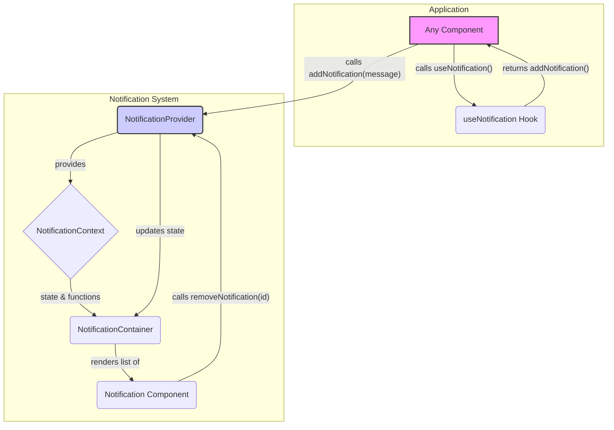

# Notification and Error Handling Refactor Design

This document outlines the design for a new, unified notification and error handling system for the SafePin application. This system will replace the legacy, DOM-manipulating utility and integrate with the existing custom error classes.

## 1. System Architecture

The new system will be built around React's Context API to provide a centralized and modern way of managing user-facing messages.

The architecture consists of three main components:

*   **`NotificationProvider`**: This component will wrap the entire application (or a significant part of it) in the component tree. It will house the state for all active notifications and expose functions to add or remove them via a context.
*   **`NotificationContainer`**: This component will be rendered once at a high level in the application layout. It will be responsible for subscribing to the notification context and rendering a list of all active `Notification` components. It will act as a visual container for all notifications, likely positioned in a corner of the screen (e.g., top-right).
*   **`Notification`**: This is a presentational component that renders a single notification message. It will receive the notification's content, type (e.g., 'success', 'error', 'info'), and an ID as props. It will also be responsible for its own dismissal, either via a user click on a close button or after a set timeout. The styling of this component will change based on the notification type to provide clear visual feedback to the user.

The data flow is as follows:
1.  Any component in the application can use the `useNotification` hook to get access to the `addNotification` function.
2.  When `addNotification` is called (with a simple string or a custom error object), the `NotificationProvider` adds a new notification object to its internal state array.
3.  The `NotificationContainer`, subscribed to this state, re-renders to display the new notification.
4.  The `Notification` component handles its own removal from the state by calling a `removeNotification` function (also from the context) after a timeout or on user interaction.



## 2. Context and Hook API

The `NotificationContext` will provide the following data and functions:

**State:**
*   `notifications`: An array of notification objects. Each object will have the following structure:
    ```javascript
    {
      id: string, // Unique identifier
      message: string, // The primary message text
      type: 'success' | 'error' | 'info' | 'warning', // Determines styling
      details?: string, // Optional additional details, e.g., from an error object
      duration?: number // Optional duration in ms before auto-dismissal
    }
    ```

**Functions:**
*   `addNotification(notification, duration = 5000)`: A function to add a new notification. It can accept a simple string (which will be treated as a success message by default) or a custom error object.
*   `removeNotification(id)`: A function to remove a notification from the state by its ID.

### `useNotification` Hook

This custom hook will be a simple wrapper around `useContext(NotificationContext)` to provide a clean and easy way for components to access the notification system.

```javascript
import { useContext } from 'react';
import { NotificationContext } from './NotificationContext';

export const useNotification = () => {
  const context = useContext(NotificationContext);
  if (!context) {
    throw new Error('useNotification must be used within a NotificationProvider');
  }
  return context;
};
```

## 3. Integration with `errorHandler.js`

The `addNotification` function will be designed to intelligently handle the custom error objects defined in the (unseen but inferred) `errorHandler.js`. When an object is passed to `addNotification` instead of a string, it will inspect the object's properties to construct a rich error notification.

Based on the `codebase_search` results, the error objects have properties like `message`, `severity`, `type`, and `stack`. The `addNotification` function will use these to create a more informative notification.

**Logic for `addNotification`:**

1.  Check if the input is a string or an object.
2.  **If it's a string:** Create a new notification object with `type: 'success'` (or another configurable default) and the string as the `message`.
3.  **If it's an object (an error):**
    *   Use the error's `message` property for the notification's `message`.
    *   Map the error's `severity` property (e.g., `ERROR_SEVERITY.HIGH`, `ERROR_SEVERITY.MEDIUM`) to the notification's `type` (e.g., 'error', 'warning'). This will control the visual style.
    *   Optionally, use other properties like `type` (e.g., `ERROR_TYPES.NETWORK`) or a cleaned `stack` trace for the `details` property of the notification, which could be displayed in an expandable section of the `Notification` component for debugging purposes.

This approach ensures that when we catch a custom error, we can pass it directly to the notification system to display a meaningful and appropriately styled message to the user without any manual mapping in the component logic.

## 4. Usage Example

Here is a code snippet demonstrating how a component would use the `useNotification` hook to display both a simple success message and a detailed error from a `try...catch` block.

```jsx
import React from 'react';
import { useNotification } from './hooks/useNotification';
import { apiCall } from './api';
// Assuming custom errors are available for import
import { NetworkError, ValidationError } from './utils/errorHandler';

function MyComponent() {
  const { addNotification } = useNotification();

  const handleSubmit = async (data) => {
    try {
      // Some API call
      const result = await apiCall(data);
      
      // Show a success message
      addNotification('Your request was successful!');

    } catch (error) {
      // The caught error could be a custom error from errorHandler.js
      // The notification system will handle it automatically.
      // For example, if it's a NetworkError with HIGH severity,
      // it will be displayed as a prominent error message.
      addNotification(error);
    }
  };

  return (
    <button onClick={() => handleSubmit({ some: 'data' })}>
      Submit
    </button>
  );
}