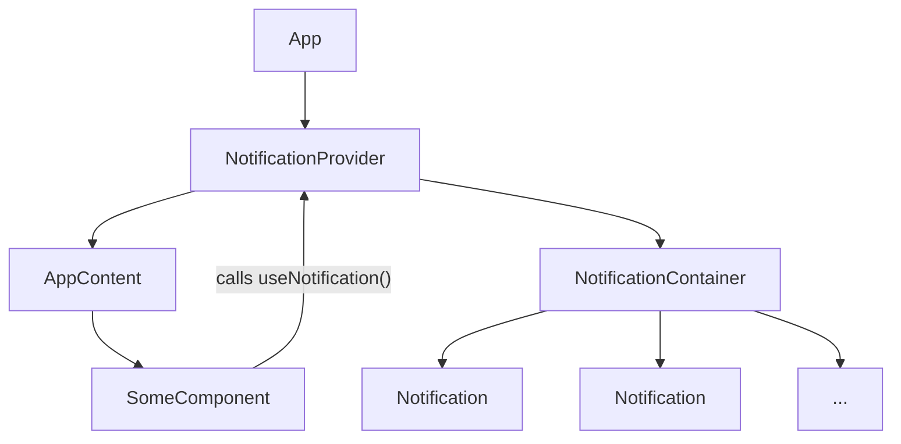

# Notification System Design

This document outlines the design for a new React-based notification system for the SafePin application. This system will provide a modern, reusable, and centralized way to display notifications to the user, replacing the legacy DOM-manipulating utility found in `src/utils/ui.js`.

## 1. Component Structure

The notification system will be composed of three main components working together to manage and display notifications.

### `NotificationProvider`

*   **Responsibility:** This component is the heart of the system. It will wrap the entire application (or a significant part of it) and use React's Context API to manage the state of all notifications.
*   **State Management:** It will maintain an array of notification objects. Each object will contain details like a unique ID, the message, the type (e.g., 'success', 'error', 'info'), and an optional timeout for automatic dismissal.
*   **Functions:** It will provide functions to add and remove notifications from the state. These functions will be passed down through the context value.

### `NotificationContainer`

*   **Responsibility:** This component is responsible for rendering the list of active notifications. It will consume the notification state from the `NotificationContext`.
*   **Positioning:** It will be styled to appear in a fixed position on the screen, such as the top-right or bottom-left corner, overlaying other content.
*   **Rendering:** It will map over the array of notifications from the context and render a `Notification` component for each one.

### `Notification`

*   **Responsibility:** This is a presentational component that renders a single notification message.
*   **Styling:** It will have different styles based on the notification `type` (e.g., green for 'success', red for 'error', blue for 'info').
*   **Interactivity:** It will include a close button that allows the user to manually dismiss the notification. Clicking this button will trigger the `removeNotification` function from the context.

Here is a Mermaid diagram illustrating the component hierarchy:



## 2. Context and Hook API

The `NotificationContext` will provide the core logic and state, which will be easily accessible via the `useNotification` custom hook.

### `NotificationContext`

The context will expose an object with the following shape:

```javascript
{
  notifications: [
    // Example notification object
    {
      id: '1662564934234',
      message: 'Your report has been submitted successfully.',
      type: 'success', // 'success' | 'error' | 'info' | 'warning'
    }
  ],
  addNotification: (message, type) => { /* ... */ },
  removeNotification: (id) => { /* ... */ }
}
```

*   **`notifications` (Array<Object>):** An array of active notification objects.
    *   `id` (string): A unique identifier (e.g., timestamp or UUID).
    *   `message` (string): The content of the notification.
    *   `type` (string): The type of notification, which determines its styling.
*   **`addNotification(message, type)` (Function):** A function to add a new notification to the list. It will automatically generate a unique `id` and handle auto-dismissal via a timeout.
*   **`removeNotification(id)` (Function):** A function to remove a notification from the list by its `id`.

### `useNotification` Hook

This custom hook will provide a simple and clean way for any component within the `NotificationProvider`'s scope to access the context's functions.

```javascript
const { addNotification, removeNotification } = useNotification();
```

It will abstract away the `useContext(NotificationContext)` call, making components cleaner and less coupled to the context implementation itself.

## 3. Usage Example

Here is a code snippet demonstrating how a component (e.g., a login form) would use the `useNotification` hook to display success or error messages.

```jsx
import React from 'react';
import { useNotification } from '../hooks/useNotification'; // Assuming the hook is in this path
import { loginUser } from '../services/auth.service';

function LoginForm() {
  const { addNotification } = useNotification();

  const handleSubmit = async (event) => {
    event.preventDefault();
    const { email, password } = event.target.elements;

    try {
      await loginUser(email.value, password.value);
      addNotification('Login successful! Welcome back.', 'success');
      // Redirect user or update UI
    } catch (error) {
      addNotification(`Login failed: ${error.message}`, 'error');
    }
  };

  return (
    <form onSubmit={handleSubmit}>
      {/* Form fields for email and password */}
      <button type="submit">Log In</button>
    </form>
  );
}

export default LoginForm;
```

This design provides a robust, decoupled, and easy-to-use system for handling notifications throughout the SafePin application, adhering to modern React best practices.