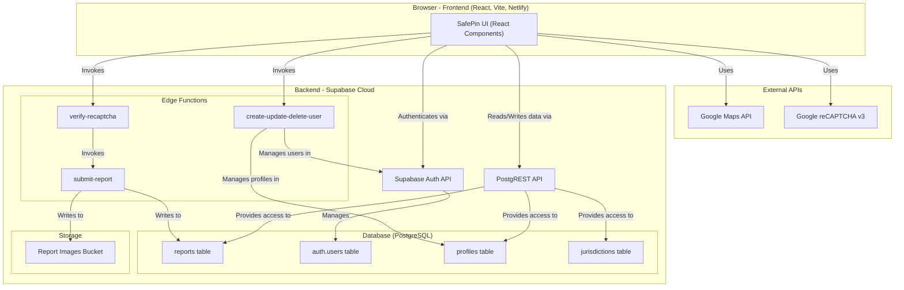
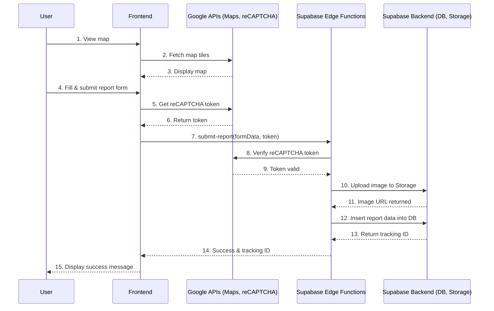
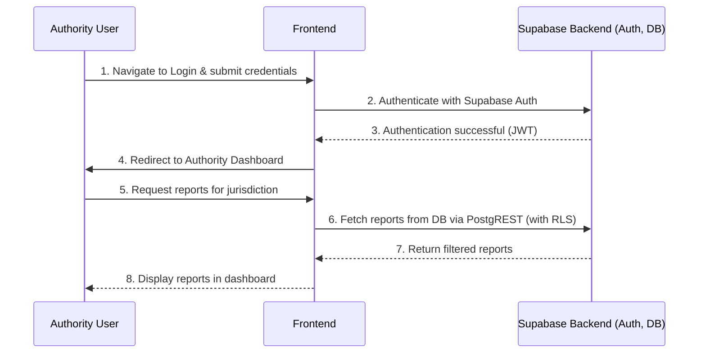
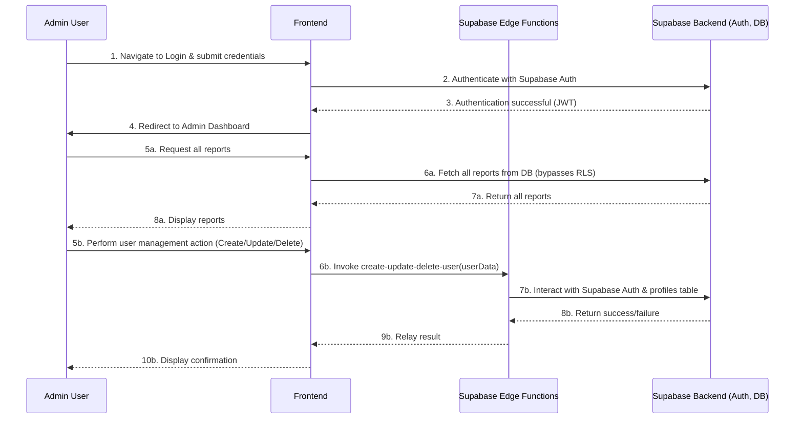

# SafePin

**SafePin** is a web-based crime-reporting platform designed to empower citizens to anonymously report crimes and threats via an interactive map. It strengthens public safety efforts by structuring access to reports based on user roles—ensuring privacy, increasing community awareness, and improving authority response.

## Table of Contents

- [Project Status](#project-status)
- [Key Features](#key-features)
- [Architecture](#architecture)
- [Technology Stack](#technology-stack)
- [Local Development Setup](#local-development-setup)
- [Available Scripts](#available-scripts)
- [Deployment](#deployment)
- [Contributing](#contributing)
- [License](#license)

## Project Status

This project is currently in a stable state. All major features have been implemented, and all known bugs have been resolved. The application is ready for deployment.

## Key Features

*   **Anonymous Crime Reporting:** Empowers citizens to report crimes, threats, and safety concerns without disclosing their identity, encouraging more reports and enhancing community safety.
*   **Interactive Map Interface:** A user-friendly, interactive map allows users to view, filter, and submit reports with precise location data, providing a clear visual overview of safety in their area.
*   **Role-Based Access Control (RBAC):** A robust RBAC system ensures that data is only accessible to authorized personnel.
  *   **Admins:** Have full control over the system, including user management, report moderation, and system-wide analytics.
  *   **Authorities:** Can view and manage reports within their designated jurisdiction, enabling efficient and targeted responses.
  *   **Users/Citizens:** Can anonymously submit and track their reports.
*   **Secure User and Session Management:** Implements best practices for security, including email verification, rate limiting, secure session management with timeouts, and robust password policies.
*   **Comprehensive Reporting System:** Users can submit detailed reports with images, descriptions, and categorization, providing authorities with the necessary information to take action.
*   **Real-Time Report Tracking:** Citizens can track the status of their submitted reports using a unique tracking code, providing transparency and peace of mind.
*   **Community Safety Monitoring:** The platform provides a public-facing dashboard with aggregated data and trends, helping to raise community awareness and promote proactive safety measures.

## Architecture

This diagram shows the static components of the SafePin system and their relationships.



### User Flows

This section contains diagrams illustrating the primary user flows for each user role.

#### Public User Flow (Anonymous Reporting)



#### Authority User Flow



#### Admin User Flow



## Technology Stack

### Frontend

*   **Framework:** React with Vite
*   **Styling:** Tailwind CSS
*   **UI Components:** Radix UI, Lucide React
*   **Routing:** React Router
*   **State Management:** React Context
*   **Forms:** React Hook Form
*   **Maps:** Google Maps JavaScript API
*   **Charts & Data Visualization:** Nivo

### Backend

*   **Platform:** Supabase
*   **Database:** PostgreSQL
*   **Authentication:** Supabase Auth
*   **Storage:** Supabase Storage
*   **Serverless Functions:** Supabase Edge Functions

### Testing

*   **Unit & Integration:** Vitest, React Testing Library
*   **E2E:** Playwright
*   **Accessibility:** Axe

## Setting Up Your Development Environment

### 1. Install Chocolatey (Package Manager)

Chocolatey is a package manager for Windows that simplifies the installation of software.

1.  **Open PowerShell as Administrator:**
    *   Press `Win + X` and select "Windows PowerShell (Admin)".
2.  **Run the installation script:**
    ```powershell
    Set-ExecutionPolicy Bypass -Scope Process -Force; [System.Net.ServicePointManager]::SecurityProtocol = [System.Net.ServicePointManager]::SecurityProtocol -bor 3072; iex ((New-Object System.Net.WebClient).DownloadString('https://community.chocolatey.org/install.ps1'))
    ```
3.  **Close and reopen PowerShell** to ensure Chocolatey is in your path.

### 2. Install Node.js and Git

You can now use Chocolatey to install Node.js (which includes npm) and Git.

```powershell
choco install -y nodejs-lts git
```

### 3. Clone the Repository

1.  **Open a new terminal** (PowerShell or Git Bash).
2.  **Navigate to the directory** where you want to store the project.
3.  **Clone the repository:**
    ```bash
    git clone https://github.com/aniciete/SafePin.git
    cd SafePin
    ```

Now you can proceed with the project-specific setup below.

## Local Development Setup

*Instructions adapted from `LOCAL_SETUP.md`*

### Prerequisites

*   Node.js
*   Supabase CLI

### Installation

1. **Install Supabase CLI**
   ```bash
   npm i -g supabase
   ```
2. **Log in to Supabase**
   ```bash
   supabase login
   ```
3. **Link your Supabase project**
   ```bash
   supabase link --project-ref <your-project-ref>
   ```
4. **Start the local Supabase environment**
   ```bash
   supabase start
   ```
5. **Set up your `.env` file**
   Copy the example file:
   ```bash
   cp .env.example .env
   ```
   Then, fill in the values from the `supabase start` output.
6. **Install project dependencies**
   ```bash
   npm install
   ```
7. **Apply database migrations**
   ```bash
   supabase db reset
   ```
8. **Run the application**
   ```bash
   npm run dev
   ```

## Available Scripts

*   `npm run dev`: Starts the development server.
*   `npm run build`: Builds the application for production.
*   `npm run lint`: Lints the source code.
*   `npm run format`: Formats the source code.
*   `npm run test`: Runs unit and integration tests.
*   `npm run test:e2e`: Runs end-to-end tests with Playwright.

## Supabase Edge Functions

This project uses several Supabase Edge Functions to handle backend logic:

*   **`create-user`**: Handles the creation of new users.
*   **`delete-user`**: Handles the deletion of users.
*   **`update-user`**: Handles updating user information.
*   **`submit-report`**: Processes and stores new crime reports.
*   **`verify-recaptcha`**: Verifies reCAPTCHA challenges to prevent spam.

## Deployment

*Instructions adapted from `DEPLOYMENT.md`*

The frontend is deployed to Netlify and the backend is hosted on Supabase. The deployment process involves setting up the Supabase project for production and then deploying the frontend to Netlify.

### Supabase Production Setup

1. Rename the Supabase project to reflect its production status.
2. Enable Point-in-Time Recovery (PITR) for backups.
3. Set production secrets using the Supabase CLI.
4. Deploy Edge Functions.
5. Push the latest database migrations.

### Netlify Frontend Deployment

1. Run all tests to ensure the application is stable.
2. Build the frontend for production.
3. Deploy the `dist` directory to Netlify.
4. Configure environment variables in the Netlify UI.
5. Update the Site URL in the Supabase dashboard.

## Contributing

1. Create a feature branch.
2. Make your changes.
3. Write or update tests.
4. Submit a pull request.
