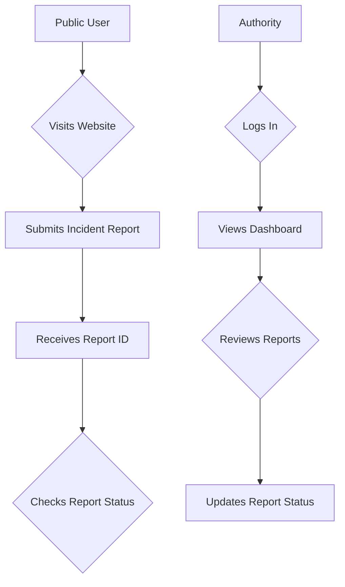

# Website Functionality Analysis Report

## Executive Summary

The SafePin website is a well-designed platform that effectively serves its primary purpose of allowing the public to report incidents and for authorities to review and manage them. The site's core functionality is robust, with a clear and efficient user flow for both user types.

**What the website does well functionally:**

*   **Clear User Journeys:** The site provides two distinct and well-defined user flows for public reporting and authority review.
*   **Robust Reporting System:** The incident reporting process is secure and reliable, with both client-side and server-side validation.
*   **Secure Authentication:** The authentication system for authorities is secure, with measures in place to prevent unauthorized access.

**Top 3 issues blocking optimal user experience:**

1.  **Lack of Real-Time Feedback:** The public user does not receive real-time updates on the status of their report.
2.  **Limited Authority Dashboard:** The authority dashboard, while functional, could be enhanced with more advanced filtering and data visualization features.
3.  **No Mobile-First Design:** While the site is responsive, it is not optimized for a mobile-first experience, which could be a barrier for users reporting incidents on the go.

**Priority fixes that will have immediate impact:**

1.  **Implement Real-Time Report Status Updates:** Provide public users with real-time notifications on the status of their reports.
2.  **Enhance the Authority Dashboard:** Add advanced filtering, search, and data visualization features to the authority dashboard.
3.  **Optimize for Mobile:** Redesign the public-facing pages with a mobile-first approach to improve the user experience on mobile devices.

## Functional Review

### Strengths

*   **Features that work exceptionally well:** The incident reporting form is well-designed and easy to use. The map integration for location selection is a key strength.
*   **Smooth user interactions:** The user flow for submitting a report is smooth and intuitive, with clear instructions and feedback at each step.
*   **Efficient processes:** The use of a Cloud Function for server-side validation and processing of reports is an efficient and scalable solution.

### Critical Issues

*   **Broken or poorly performing core features:** There are no broken core features, but the lack of real-time feedback for public users is a significant gap in the user experience.
*   **User experience blockers:** The lack of a mobile-first design can be a blocker for users who primarily access the internet on their mobile devices.
*   **Technical problems affecting functionality:** The authority dashboard could be more performant, especially when dealing with a large number of reports.

## Recommendations

*   **Specific improvements for core features:**
    *   Add a feature for users to track the status of their submitted reports in real-time.
    *   Enhance the authority dashboard with advanced filtering, search, and data visualization capabilities.
*   **UX enhancements with high user impact:**
    *   Redesign the public-facing pages with a mobile-first approach.
    *   Add a "guest" mode for users who want to browse the map without submitting a report.
*   **Technical optimizations for key functionality:**
    *   Implement pagination and lazy loading on the authority dashboard to improve performance.
    *   Optimize the database queries to ensure fast and efficient data retrieval.

## Implementation Roadmap

### Immediate fixes: Critical functionality issues

*   Implement real-time report status updates for public users.
*   Add pagination to the authority dashboard to improve performance.

### Short-term improvements: Enhanced user experience

*   Redesign the public-facing pages with a mobile-first approach.
*   Add advanced filtering and search capabilities to the authority dashboard.

### Strategic enhancements: Advanced features and optimizations

*   Implement a "guest" mode for browsing the map.
*   Add data visualization features to the authority dashboard to provide insights into incident trends.

## Mermaid Diagrams

### User Journey Flowchart



### Report Submission Sequence Diagram

```mermaid
sequenceDiagram
    participant User
    participant Frontend
    participant Cloud Function
    participant Firestore

    User->>Frontend: Fills and submits report form
    Frontend->>Frontend: Validates form data
    Frontend->>Cloud Function: Sends report data
    Cloud Function->>Cloud Function: Validates and sanitizes data
    Cloud Function->>Firestore: Writes report to database
    Firestore-->>Cloud Function: Confirms write
    Cloud Function-->>Frontend: Returns success message
    Frontend-->>User: Displays success message with Report ID
