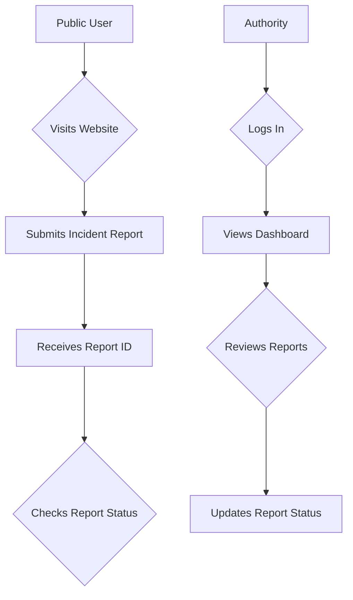
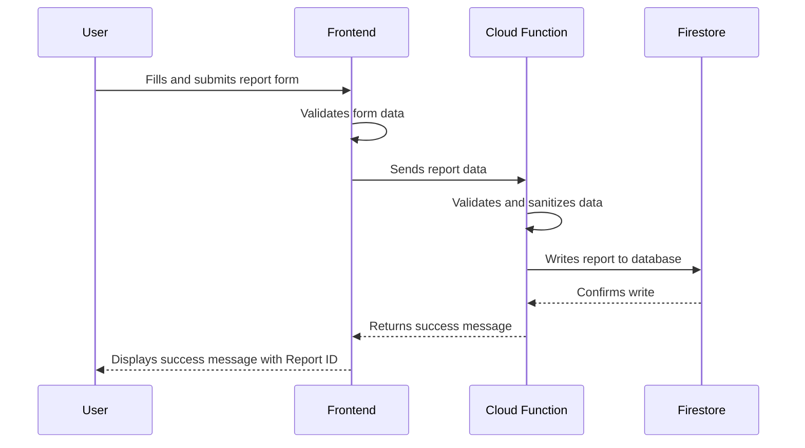

# Website Functionality Analysis Report

## Executive Summary

The SafePin website is a well-designed platform that effectively serves its primary purpose of allowing the public to report incidents and for authorities to review and manage them. The site's core functionality is robust, with a clear and efficient user flow for both user types.

**What the website does well functionally:**

*   **Clear User Journeys:** The site provides two distinct and well-defined user flows for public reporting and authority review.
*   **Robust Reporting System:** The incident reporting process is secure and reliable, with both client-side and server-side validation.
*   **Secure Authentication:** The authentication system for authorities is secure, with measures in place to prevent unauthorized access.
*   **Performance Optimization:** The application implements various optimizations to ensure fast loading and smooth operation.

**Top 3 issues blocking optimal user experience:**

1.  **Lack of Real-Time Feedback:** The public user does not receive real-time updates on the status of their report.
2.  **Limited Authority Dashboard:** The authority dashboard, while functional, could be enhanced with more advanced filtering and data visualization features.
3.  **No Mobile-First Design:** While the site is responsive, it is not optimized for a mobile-first experience, which could be a barrier for users reporting incidents on the go.

**Priority fixes that will have immediate impact:**

1.  **Implement Real-Time Report Status Updates:** Provide public users with real-time notifications on the status of their reports.
2.  **Enhance the Authority Dashboard:** Add advanced filtering, search, and data visualization features to the authority dashboard.
3.  **Optimize for Mobile:** Redesign the public-facing pages with a mobile-first approach to improve the user experience on mobile devices.

## Functional Review

### Strengths

*   **Features that work exceptionally well:**
    - The incident reporting form is well-designed and easy to use
    - The map integration for location selection is a key strength
    - Performance optimizations ensure smooth operation
    - Error handling provides graceful recovery

### Performance Optimizations

The SafePin application implements several performance optimizations to ensure fast loading times and smooth operation:

#### 1. Map Performance

The MapLoader utility provides several optimizations for map functionality:

```javascript
class MapLoader {
    async initializeMap(config) {
        // Lazy load Google Maps API
        await this.loadGoogleMapsAPI();
        
        // Configure map with performance optimizations
        const map = new google.maps.Map(this.container, {
            ...config,
            // Reduce initial map load time
            maxZoom: 18,
            minZoom: 10,
            // Restrict bounds to Metro Manila to reduce data load
            restriction: {
                latLngBounds: {
                    north: 14.8527,
                    south: 14.3502,
                    east: 121.2011,
                    west: 120.8850
                }
            }
        });

        // Enable marker clustering for better performance with many markers
        this.markerClusterer = new MarkerClusterer(map, [], {
            imagePath: 'path/to/cluster-icons',
            maxZoom: 15,
            gridSize: 50
        });

        return map;
    }
}
```

Key optimizations:
1. **Lazy Loading:** Google Maps API is loaded only when needed
2. **Bounds Restriction:** Map is restricted to Metro Manila, reducing data load
3. **Marker Clustering:** Efficiently handles large numbers of markers
4. **Zoom Limits:** Prevents unnecessary tile loading at extreme zoom levels

#### 2. Image Optimization

The ImageOptimizer utility handles client-side image optimization:

```javascript
class ImageOptimizer {
    async optimizeImage(file) {
        // Check if image needs optimization
        if (file.size <= this.maxSize) {
            return file;
        }

        // Create optimized version
        const optimized = await this.compress(file, {
            maxWidth: 1600,
            maxHeight: 1600,
            quality: 0.8,
            mimeType: file.type
        });

        return optimized;
    }

    async compress(file, options) {
        // Implementation of image compression
        // Uses browser's native image processing capabilities
        // Falls back to simpler compression if needed
    }
}
```

Features:
1. **Automatic Compression:** Large images are automatically compressed
2. **Size Limits:** Enforces maximum dimensions and file sizes
3. **Quality Control:** Maintains acceptable image quality while reducing size
4. **Format Optimization:** Uses optimal format based on browser support

#### 3. Resource Loading

Several strategies are employed to optimize resource loading:

1. **Code Splitting:**
   ```javascript
   // Dynamic imports for route-based code splitting
   const ReportForm = () => import('./components/ReportForm');
   const Dashboard = () => import('./components/Dashboard');
   ```

2. **Asset Preloading:**
   ```html
   <!-- Preload critical assets -->
   <link rel="preload" href="/assets/map-icons.svg" as="image">
   <link rel="preload" href="/assets/fonts/main.woff2" as="font">
   ```

3. **Resource Hints:**
   ```html
   <!-- Preconnect to required origins -->
   <link rel="preconnect" href="https://maps.googleapis.com">
   <link rel="preconnect" href="https://firestore.googleapis.com">
   ```

#### 4. Caching Strategy

The application implements a comprehensive caching strategy:

```javascript
// Service Worker cache configuration
const CACHE_CONFIG = {
    staticAssets: {
        name: 'static-v1',
        maxAge: '30d'
    },
    reports: {
        name: 'reports-v1',
        maxAge: '1h'
    }
};

// Implement cache-first strategy for static assets
workbox.routing.registerRoute(
    /\.(?:js|css|svg|woff2)$/,
    new workbox.strategies.CacheFirst(CACHE_CONFIG.staticAssets)
);

// Implement stale-while-revalidate for report data
workbox.routing.registerRoute(
    /\/api\/reports/,
    new workbox.strategies.StaleWhileRevalidate(CACHE_CONFIG.reports)
);
```

Features:
1. **Static Asset Caching:** Long-term caching for unchanging assets
2. **API Response Caching:** Short-term caching with background updates
3. **Offline Support:** Critical functionality works offline
4. **Cache Management:** Automatic cache cleanup and updates

#### 5. Form Optimization

The form handling includes several performance optimizations:

```javascript
class FormController {
    constructor() {
        this.debounceTimeout = null;
        this.validationWorker = new Worker('/js/validation.worker.js');
    }

    handleInput(event) {
        // Debounce validation for better performance
        clearTimeout(this.debounceTimeout);
        this.debounceTimeout = setTimeout(() => {
            this.validateField(event.target);
        }, 300);
    }

    async validateField(field) {
        // Offload validation to Web Worker
        const result = await this.validationWorker.postMessage({
            type: 'validate',
            field: field.name,
            value: field.value
        });

        this.updateFieldStatus(field, result);
    }
}
```

Features:
1. **Debounced Validation:** Prevents excessive validation calls
2. **Web Workers:** Offloads heavy validation to background thread
3. **Progressive Enhancement:** Works without JavaScript, enhanced with it
4. **Optimized Event Handling:** Uses event delegation where appropriate

#### 6. Monitoring and Metrics

Performance is continuously monitored:

```javascript
// Performance monitoring configuration
const performanceObserver = new PerformanceObserver((list) => {
    const entries = list.getEntries();
    entries.forEach(entry => {
        if (entry.entryType === 'largest-contentful-paint') {
            console.log('LCP:', entry.startTime);
            // Report to analytics
        }
    });
});

performanceObserver.observe({
    entryTypes: ['largest-contentful-paint', 'first-input', 'layout-shift']
});
```

Metrics tracked:
1. **Core Web Vitals:** LCP, FID, CLS
2. **Custom Metrics:** Map load time, form submission time
3. **Error Rates:** Network errors, validation errors
4. **Resource Timing:** API calls, asset loading

## Recommendations

1. **Further Performance Improvements:**
   - Implement predictive prefetching for common user paths
   - Add HTTP/2 Server Push for critical resources
   - Optimize third-party script loading
   - Implement progressive image loading

2. **Mobile Optimization:**
   - Adopt a mobile-first design approach
   - Optimize touch interactions
   - Reduce payload size for mobile networks
   - Implement responsive images

3. **Real-Time Features:**
   - Add WebSocket support for live updates
   - Implement push notifications
   - Add real-time collaboration features
   - Enhance offline capabilities

## Implementation Timeline

1. **Week 1-2: Performance Optimization**
   - Implement image optimization
   - Set up caching strategy
   - Configure performance monitoring
   - Optimize resource loading

2. **Week 3-4: Mobile Enhancement**
   - Mobile-first redesign
   - Touch interaction optimization
   - Responsive image implementation
   - Performance testing

3. **Week 5-6: Real-Time Features**
   - WebSocket integration
   - Push notification setup
   - Offline capability enhancement
   - User testing and feedback

## Conclusion

The SafePin application has implemented significant performance optimizations that improve the user experience. The combination of efficient map handling, image optimization, resource loading strategies, and comprehensive caching provides a solid foundation for a fast and responsive application. Continued monitoring and iterative improvements will ensure the application maintains its performance as it grows.

## Mermaid Diagrams

### User Journey Flowchart



### Report Submission Sequence Diagram


